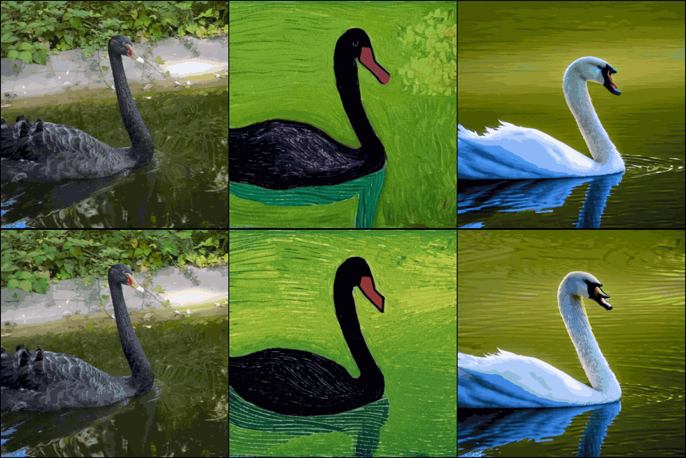
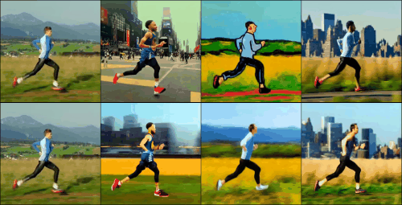

##

# **Enhancing Low-Cost Video Editing with Lightweight Adaptors and Temporal-Aware Inversion**

## Authors
Yangfan He (University of Minnesota - Twin Cities, [he000577@umn.edu](mailto:he000577@umn.edu)), Sida Li (Peking University, [2200013094@stu.pku.edu.cn]), Jianhui Wang (University of Electronic Science & Technology of China, [20220991605023@std.uestc.edu.cn](mailto:20220991605023@std.uestc.edu.cn)), Binxu Li (Stanford University, [andy0207@stanford.edu](mailto:andy0207@stanford.edu)), Jiajun Liang† (Megvii Technology, [liangjiajun@megvii.com](mailto:liangjiajun@megvii.com))
## Getting Started
1. Clone this repository:
```bash
git clone https://github.com/codepassionor/Tokenflow_adapter.git
```
2. Install the dependencies:
```bash
conda create --name myenv python=3.10
conda activate myenv
pip install -r requirements.txt
```

## Training

#### 1. **Dataset Preparation (`make_dataset`)**
Before starting the training process, ensure the dataset is correctly prepared. Please download the MSRVTT dataset locally first, you can get it through this link [MRSVTT](https://markdown.com.cn).

Then use the following script to organize and preprocess your data for training:
```bash
python make_dataset/msrvtt-depth-map.py
```
This script handles dataset cleaning, and formatting to meet the training requirements.

---

#### 2. **Training ControlNet (`train_controlnet`)**
To train ControlNet using a single GPU, you can directly run the following script:

```bash
bash train_controlnet.sh
```
For multi-GPU training, make the necessary modifications in `train_controlnet.sh`, and refer to the example below:

```bash
export CUDA_VISIBLE_DEVICES=0,1,2,3
accelerate launch     \
                    --num_machines 1  \
                    --num_processes 1 \
                    --gpu_ids 1       \
                    --num_cpu_threads_per_process 1 \
    main_controlnet.py 
--pretrained_model_name_or_path /data/workspace/huggingface/hub/runwayml/stable-diffusion-v1-5        --rank 4  --train_batch_size 1  --mixed_precision no
```

---

#### 3. **Training DDPM (`main_ddp`)**
Use the script below for DDPM training:

```bash
bash train_multigpu.sh
```
To accelerate web connections, the `train_ddpm.sh` script uses `proxychains`. If you encounter connection issues, verify your proxy settings. For multi-GPU training, you can modify the script and use a similar setup as shown in the ControlNet example above.

#### 3. **Training DDPM (`train_ddpm`)**
Use the script below for DDPM training:

## Visualization
This section shows some visualization results on downstream algorithms.




We provide a comparison of the effects of different timesteps of the training and inference process for you to pick the desired parameters.


## Todo List

- [x] Adapter Training and Downstream Task Inference
- [x] Add Bilateral Filter Module to Inversion Process
- [ ] Secondary Optimization of Dataset
- [ ] Restructuring Prompt Learner
- [ ] Open-source More Visualization Results
- [ ] Add Model Distillation Module

## Citation

If you found this repository useful, please consider citing our paper:

```bibtex
@article{yang2024wcdt,
  title={WcDT: World-centric Diffusion Transformer for Traffic Scene Generation},
  author={Yang, Chen and Tian, Aaron Xuxiang and Chen, Dong and Shi, Tianyu and Heydarian, Arsalan},
  journal={arXiv preprint arXiv:2404.02082},
  year={2024}
}
```

# Project Announcement

We are excited to announce that following the acceptance of this paper, we will release the final checkpoint, testing code, bilateral filtering algorithm implementation, and a complete project webpage. 

Stay tuned for updates!

